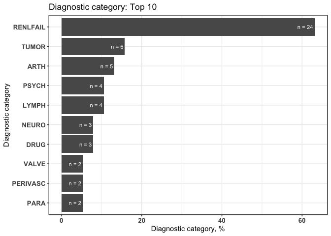

## dxpr

# I. Introduction

The proposed open-source dxpr package is a software tool aimed at
expediting an integrated analysis of electronic health records (EHRs).
The dxpr package provides mechanisms to integrate, analyze, and
visualize clinical data, including diagnosis and procedure records.

## Feature

  - **Data integration** Transform codes into uniform format and group
    code into several categories.  
  - **Data Wrangling** Generate statistical information about dataset
    and transform data into wide format, which fits better to other
    analytical and plotting packages.
  - **Visualization** Provide overviews for the result of diagnoses
    standardization and the grouped categories of diagnosis codes.

## Getting started

  - Diagnostic part  
    English:
    <https://dhlab-tseng.github.io/dxpr/articles/Eng_Diagnosis.html>  
    Chinese:
    <https://dhlab-tseng.github.io/dxpr/articles/Chi_Diagnosis.html>  
  - Procedure part  
    English:
    <https://dhlab-tseng.github.io/dxpr/articles/Eng_Procedure.html>  
    Chinese:
    <https://dhlab-tseng.github.io/dxpr/articles/Chi_Procedure.html>

## Development version

``` r
# install.packages("devtools")
devtools::install_github("DHLab-TSENG/dxpr")
```

## Overview


## Usage

``` r
library(dxpr)  
 
head(sampleDxFile)  
#>     ID  ICD       Date
#> 1:  A2 Z992 2020-05-22
#> 2:  A5 Z992 2020-01-24
#> 3:  A8 Z992 2015-10-27
#> 4: A13 Z992 2020-04-26
#> 5: A13 Z992 2025-02-02
#> 6: A15 Z992 2023-05-12

# I. Data integration
#   1. Data standardization
short <- icdDxDecimalToShort(dxDataFile = sampleDxFile, 
                             icdColName = ICD, 
                             dateColName = Date,
                             icd10usingDate = "2015/10/01")
head(short$ICD)
#>     ICD
#> 1: Z992
#> 2: Z992
#> 3: Z992
#> 4: Z992
#> 5: Z992
#> 6: Z992

tail(short$Error)
#>       ICD count IcdVersionInFile     WrongType Suggestion
#> 1:  75.52     4            ICD 9  Wrong format           
#> 2:  E03.0     4            ICD 9 Wrong version           
#> 3:    650     4           ICD 10 Wrong version           
#> 4: 123.45     3           ICD 10  Wrong format           
#> 5:  755.2     3            ICD 9  Wrong format     755.29
#> 6:   7552     2            ICD 9  Wrong format      75529

#   2. Data grouping
ELIX <- icdDxToComorbid(dxDataFile = sampleDxFile, 
                        idColName = ID, 
                        icdColName = ICD, 
                        dateColName = Date, 
                        icd10usingDate = "2015/10/01", 
                        comorbidMethod = elix)
head(ELIX$groupedDT)
#>    Short  ID  ICD       Date Comorbidity
#> 1:  Z992  A2 Z992 2020-05-22    RENLFAIL
#> 2:  Z992  A5 Z992 2020-01-24    RENLFAIL
#> 3:  Z992  A8 Z992 2015-10-27    RENLFAIL
#> 4:  Z992 A13 Z992 2020-04-26    RENLFAIL
#> 5:  Z992 A13 Z992 2025-02-02    RENLFAIL
#> 6:  Z992 A15 Z992 2023-05-12    RENLFAIL

head(ELIX$summarised_groupedDT)
#>     ID Comorbidity firstCaseDate endCaseDate count    period
#> 1:  A0    RENLFAIL    2009-07-25  2013-12-20     5 1609 days
#> 2:  A1    RENLFAIL    2006-11-29  2014-09-24     5 2856 days
#> 3: A10    RENLFAIL    2007-11-04  2012-07-30     5 1730 days
#> 4: A11    RENLFAIL    2008-03-09  2011-09-03     5 1273 days
#> 5: A12    RENLFAIL    2006-05-14  2015-06-29     5 3333 days
#> 6: A13    RENLFAIL    2006-04-29  2025-02-02     5 6854 days

# II. Data wrangling
groupedDataWide <- groupedDataLongToWide(dxDataFile = ELIX$groupedDT, 
                                         idColName = ID, 
                                         categoryColName = Comorbidity, 
                                         dateColName = Date)
head(groupedDataWide[,1:4])
#>     ID  ARTH CHRNLUNG  DMCX
#> 1:  A0 FALSE    FALSE FALSE
#> 2:  A1 FALSE    FALSE FALSE
#> 3: A10 FALSE    FALSE FALSE
#> 4: A11 FALSE    FALSE FALSE
#> 5: A12 FALSE    FALSE FALSE
#> 6: A13 FALSE    FALSE FALSE

# IV. Visualization
plot_errorICD <- plotICDError(short$Error)  
plot_groupedData <- plotDiagCat(groupedDataWide, ID)

plot_errorICD
#> $graph
```

<!-- -->

    #> 
    #> $ICD
    #>        ICD count CumCountPerc IcdVersionInFile     WrongType Suggestion
    #>  1:  A0.11    20       18.35%           ICD 10  Wrong format           
    #>  2:  V27.0    18       34.86%           ICD 10 Wrong version           
    #>  3:   E114     8        42.2%           ICD 10  Wrong format           
    #>  4: A01.05     8       49.54%            ICD 9 Wrong version           
    #>  5:  42761     7       55.96%           ICD 10 Wrong version           
    #>  6:  Z9.90     6       61.47%           ICD 10  Wrong format           
    #>  7:    F42     6       66.97%           ICD 10  Wrong format           
    #>  8:  V24.1     6       72.48%           ICD 10 Wrong version           
    #>  9:  A0105     5       77.06%            ICD 9 Wrong version           
    #> 10:    001     5       81.65%            ICD 9  Wrong format       0019
    #> 11: others    20         100%            ICD 9  Wrong format
    
    plot_groupedData
    #> $graph

<!-- -->

    #> 
    #> $sigCate
    #>     DiagnosticCategory  N Percentage
    #>  1:           RENLFAIL 24      63.16
    #>  2:              TUMOR  6      15.79
    #>  3:               ARTH  5      13.16
    #>  4:              LYMPH  4      10.53
    #>  5:              PSYCH  4      10.53
    #>  6:               DRUG  3       7.89
    #>  7:              NEURO  3       7.89
    #>  8:               PARA  2       5.26
    #>  9:           PERIVASC  2       5.26
    #> 10:              VALVE  2       5.26

## Getting help

See the `GitHub issues page`
(<https://github.com/DHLab-CGU/dxpr/issues>) to see open issues and
feature requests.
