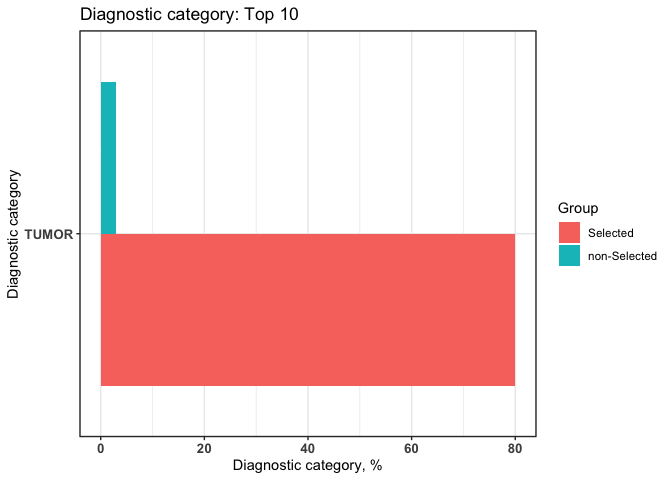

# Usage of dxpr Package

## I. Data integration

    head(sampleDxFile)  
    #>     ID  ICD       Date Version
    #> 1:  A2 Z992 2020-05-22      10
    #> 2:  A5 Z992 2020-01-24      10
    #> 3:  A8 Z992 2015-10-27      10
    #> 4: A13 Z992 2020-04-26      10
    #> 5: A13 Z992 2025-02-02      10
    #> 6: A15 Z992 2023-05-12      10

### 1. Data standardization

    # ICD to uniform short format
    ICD_Short <- icdDxDecimalToShort(dxDataFile = sampleDxFile,
                                     icdColName = ICD,
                                     dateColName = Date, 
                                     icd10usingDate = "2015/10/01")
    #> Wrong ICD format: total 9 ICD codes (the number of occurrences is in brackets)
    #> c("A0.11 (20)", "E114 (8)", "Z9.90 (6)", "F42 (6)", "001 (5)", "75.52 (4)", "755.2 (3)", "123.45 (3)", "7552 (2)")
    #>  
    #> Wrong ICD version: total 7 ICD codes (the number of occurrences is in brackets)
    #> c("V27.0 (18)", "A01.05 (8)", "42761 (7)", "V24.1 (6)", "A0105 (5)", "E03.0 (4)", "650 (4)")
    #>  
    #> Warning: The ICD mentioned above matches to "NA" due to the format or other
    #> issues.
    #> Warning: "Wrong ICD format" means the ICD has wrong format
    #> Warning: "Wrong ICD version" means the ICD classify to wrong ICD version (cause
    #> the "icd10usingDate" or other issues)

    head(ICD_Short$ICD)
    #>     ICD
    #> 1: Z992
    #> 2: Z992
    #> 3: Z992
    #> 4: Z992
    #> 5: Z992
    #> 6: Z992

    tail(ICD_Short$Error)
    #>       ICD count IcdVersionInFile     WrongType Suggestion
    #> 1:  75.52     4            ICD 9  Wrong format           
    #> 2:  E03.0     4            ICD 9 Wrong version           
    #> 3:    650     4           ICD 10 Wrong version           
    #> 4: 123.45     3           ICD 10  Wrong format           
    #> 5:  755.2     3            ICD 9  Wrong format     755.29
    #> 6:   7552     2            ICD 9  Wrong format      75529

    sampleDxFile$Decimal <- ICD_Short$ICD 

    head(sampleDxFile)
    #>     ID  ICD       Date Version Decimal
    #> 1:  A2 Z992 2020-05-22      10    Z992
    #> 2:  A5 Z992 2020-01-24      10    Z992
    #> 3:  A8 Z992 2015-10-27      10    Z992
    #> 4: A13 Z992 2020-04-26      10    Z992
    #> 5: A13 Z992 2025-02-02      10    Z992
    #> 6: A15 Z992 2023-05-12      10    Z992

### 2. Data grouping

    # ICD to level 2 CCS description of multiple-level CCS
    CCSlvl_description <- icdDxToCCSLvl(dxDataFile = sampleDxFile,
                                        idColName = ID,
                                        icdColName = ICD,
                                        dateColName = Date, 
                                        icd10usingDate = "2015-10-01", 
                                        CCSLevel = 2,
                                        isDescription = TRUE)

    head(setorder(CCSlvl_description$groupedDT, "ID"))
    #>    Short ID   ICD       Date                CCS_LVL_2_LABEL
    #> 1:  5855 A0  5855 2013-12-20 Diseases of the urinary system
    #> 2: V4511 A0 V4511 2012-04-05 Diseases of the urinary system
    #> 3:  V560 A0  V560 2010-03-28 Diseases of the urinary system
    #> 4:  5853 A0  5853 2010-10-29 Diseases of the urinary system
    #> 5:  5856 A0  5856 2009-07-25 Diseases of the urinary system
    #> 6:   001 A0   001 2014-11-05                           <NA>

    head(CCSlvl_description$summarised_groupedDT)
    #>     ID                CCS_LVL_2_LABEL firstCaseDate endCaseDate count    period
    #> 1:  A0 Diseases of the urinary system    2009-07-25  2013-12-20     5 1609 days
    #> 2:  A1 Diseases of the urinary system    2006-11-29  2014-09-24     5 2856 days
    #> 3: A10 Diseases of the urinary system    2007-11-04  2012-07-30     5 1730 days
    #> 4: A11 Diseases of the urinary system    2008-03-09  2011-09-03     5 1273 days
    #> 5: A12 Diseases of the urinary system    2006-05-14  2015-06-29     5 3333 days
    #> 6: A13 Diseases of the urinary system    2006-04-29  2025-02-02     5 6854 days

    ## ICD to pheWAS
    pheWAS <- icdDxToPheWAS(dxDataFile  = sampleDxFile,
                            idColName = ID,
                            icdColName = ICD,
                            dateColName = Date, 
                            icd10usingDate = "2015-10-01", 
                            isDescription = FALSE)

    head(setorder(pheWAS$groupedDT, "ID"))
    #>    Decimal ID   ICD       Date PheCode
    #> 1:   585.5 A0  5855 2013-12-20  585.32
    #> 2:  V45.11 A0 V4511 2012-04-05  585.31
    #> 3:   V56.0 A0  V560 2010-03-28  585.31
    #> 4:   585.3 A0  5853 2010-10-29  585.33
    #> 5:   585.6 A0  5856 2009-07-25  585.32
    #> 6:     001 A0   001 2014-11-05     008

    head(setorder(pheWAS$summarised_groupedDT, "ID"))
    #>    ID PheCode firstCaseDate endCaseDate count    period
    #> 1: A0  585.32    2009-07-25  2013-12-20     2 1609 days
    #> 2: A0  585.31    2010-03-28  2012-04-05     2  739 days
    #> 3: A0  585.33    2010-10-29  2010-10-29     1    0 days
    #> 4: A0     008    2014-11-05  2014-11-05     1    0 days
    #> 5: A1  585.32    2006-11-29  2013-04-28     3 2342 days
    #> 6: A1  585.33    2014-09-24  2014-09-24     1    0 days

    # ICD to Comorbidity: Elixhauser
    ELIX <- icdDxToComorbid(dxDataFile  = sampleDxFile,
                            idColName = ID,
                            icdColName = ICD,
                            dateColName = Date, 
                            icd10usingDate = "2015-10-01", 
                            comorbidMethod = ELIX)

    head(setorder(ELIX$groupedDT, "ID"))
    #>    Short ID   ICD       Date Comorbidity
    #> 1:  5855 A0  5855 2013-12-20    RENLFAIL
    #> 2: V4511 A0 V4511 2012-04-05    RENLFAIL
    #> 3:  V560 A0  V560 2010-03-28    RENLFAIL
    #> 4:  5853 A0  5853 2010-10-29    RENLFAIL
    #> 5:  5856 A0  5856 2009-07-25    RENLFAIL
    #> 6:   001 A0   001 2014-11-05        <NA>

    head(ELIX$summarised_groupedDT)
    #>     ID Comorbidity firstCaseDate endCaseDate count    period
    #> 1:  A0    RENLFAIL    2009-07-25  2013-12-20     5 1609 days
    #> 2:  A1    RENLFAIL    2006-11-29  2014-09-24     5 2856 days
    #> 3: A10    RENLFAIL    2007-11-04  2012-07-30     5 1730 days
    #> 4: A11    RENLFAIL    2008-03-09  2011-09-03     5 1273 days
    #> 5: A12    RENLFAIL    2006-05-14  2015-06-29     5 3333 days
    #> 6: A13    RENLFAIL    2006-04-29  2025-02-02     5 6854 days

    # ICD to Comorbidity: AHRQ
    AHRQ <- icdDxToComorbid(dxDataFile  = sampleDxFile,
                            idColName = ID,
                            icdColName = ICD,
                            dateColName = Date, 
                            icd10usingDate = "2015-10-01", 
                            comorbidMethod = ahrq)

    head(setorder(AHRQ$groupedDT, "ID"))
    #>    Short ID   ICD       Date Comorbidity
    #> 1:  5855 A0  5855 2013-12-20       Renal
    #> 2: V4511 A0 V4511 2012-04-05       Renal
    #> 3:  V560 A0  V560 2010-03-28       Renal
    #> 4:  5853 A0  5853 2010-10-29       Renal
    #> 5:  5856 A0  5856 2009-07-25       Renal
    #> 6:   001 A0   001 2014-11-05        <NA>

    head(AHRQ$summarised_groupedDT)
    #>     ID Comorbidity firstCaseDate endCaseDate count    period
    #> 1:  A0       Renal    2009-07-25  2013-12-20     5 1609 days
    #> 2:  A1       Renal    2006-11-29  2014-09-24     5 2856 days
    #> 3: A10       Renal    2007-11-04  2012-07-30     5 1730 days
    #> 4: A11       Renal    2008-03-09  2011-09-03     5 1273 days
    #> 5: A12       Renal    2006-05-14  2015-06-29     5 3333 days
    #> 6: A13       Renal    2006-04-29  2025-02-02     5 6854 days

    # ICD to Comorbidity: Charlson
    Charlson <- icdDxToComorbid(dxDataFile  = sampleDxFile,
                            idColName = ID,
                            icdColName = ICD,
                            dateColName = Date, 
                            icd10usingDate = "2015-10-01", 
                            comorbidMethod = Charlson)

    head(setorder(Charlson$groupedDT, "ID"))
    #>    Short ID   ICD       Date Comorbidity
    #> 1:  5855 A0  5855 2013-12-20          RD
    #> 2: V4511 A0 V4511 2012-04-05          RD
    #> 3:  V560 A0  V560 2010-03-28          RD
    #> 4:  5853 A0  5853 2010-10-29          RD
    #> 5:  5856 A0  5856 2009-07-25          RD
    #> 6:   001 A0   001 2014-11-05        <NA>

    head(Charlson$summarised_groupedDT)
    #>     ID Comorbidity firstCaseDate endCaseDate count    period
    #> 1:  A0          RD    2009-07-25  2013-12-20     5 1609 days
    #> 2:  A1          RD    2006-11-29  2014-09-24     5 2856 days
    #> 3: A10          RD    2007-11-04  2012-07-30     5 1730 days
    #> 4: A11          RD    2008-03-09  2011-09-03     5 1273 days
    #> 5: A11      DIAB_C    2015-12-16  2015-12-16     1    0 days
    #> 6: A12          RD    2006-05-14  2015-06-29     5 3333 days

    # ICD to self-defined grouping method: precise matching
    groupingTable <- data.table(Group = rep("Chronic kidney disease",6),
                                ICD = c("N181","5853","5854","5855","5856","5859"))

    groupingTable
    #>                     Group  ICD
    #> 1: Chronic kidney disease N181
    #> 2: Chronic kidney disease 5853
    #> 3: Chronic kidney disease 5854
    #> 4: Chronic kidney disease 5855
    #> 5: Chronic kidney disease 5856
    #> 6: Chronic kidney disease 5859

    CustomGroup <- icdDxToCustom(dxDataFile  = sampleDxFile,
                                 idColName = ID,
                                 icdColName = ICD, 
                                 dateColName = Date, 
                                 customGroupingTable = groupingTable)

    head(setorder(CustomGroup$groupedDT, "ID"))
    #>      ICD ID       Date                  Group
    #> 1:  5855 A0 2013-12-20 Chronic kidney disease
    #> 2: V4511 A0 2012-04-05                   <NA>
    #> 3:  V560 A0 2010-03-28                   <NA>
    #> 4:  5853 A0 2010-10-29 Chronic kidney disease
    #> 5:  5856 A0 2009-07-25 Chronic kidney disease
    #> 6:   001 A0 2014-11-05                   <NA>

    head(CustomGroup$summarised_groupedDT)
    #>     ID                  Group firstCaseDate endCaseDate count    period
    #> 1:  A0 Chronic kidney disease    2009-07-25  2013-12-20     3 1609 days
    #> 2:  A1 Chronic kidney disease    2006-11-29  2014-09-24     4 2856 days
    #> 3: A10 Chronic kidney disease    2007-11-04  2007-11-04     1    0 days
    #> 4: A11 Chronic kidney disease    2008-03-09  2010-02-21     2  714 days
    #> 5: A12 Chronic kidney disease    2006-05-14  2011-02-25     3 1748 days
    #> 6: A13 Chronic kidney disease    2006-04-29  2010-02-21     2 1394 days

    # ICD to self-defined grouping method: fuzzy matching
    grepTable <- data.table(Group = "Chronic kidney disease",
                              grepIcd = "^585|^N18")

    grepTable
    #>                     Group   grepIcd
    #> 1: Chronic kidney disease ^585|^N18

    CustomGrepGroup <- icdDxToCustomGrep(dxDataFile  = sampleDxFile,
                                         idColName = ID,
                                         icdColName = ICD, 
                                         dateColName = Date, 
                                         customGroupingTable = grepTable)

    head(setorder(CustomGrepGroup$groupedDT, "ID"))
    #>    ID   ICD       Date            GrepedGroup
    #> 1: A0  5855 2013-12-20 Chronic kidney disease
    #> 2: A0 V4511 2012-04-05                   <NA>
    #> 3: A0  V560 2010-03-28                   <NA>
    #> 4: A0  5853 2010-10-29 Chronic kidney disease
    #> 5: A0  5856 2009-07-25 Chronic kidney disease
    #> 6: A0   001 2014-11-05                   <NA>

## II. Data wrangling

### 1. Case selection

    # Select cases by ICD condition "^585"
    Case <- selectCases(dxDataFile = sampleDxFile,
                        idColName = ID,
                        icdColName = ICD, 
                        dateColName = Date, 
                        icd10usingDate = "2015/10/01",
                        groupDataType = icd,
                        caseCondition = "^585",
                        caseCount = 2,  
                        periodRange = c(30, 365))

    head(Case)
    #>     ID selectedCase count firstCaseDate endCaseDate    period MostCommonICD
    #> 1:  A1     Selected     4    2006-11-29  2014-09-24 2856 days          5855
    #> 2: A12    Selected*     3    2006-05-14  2011-02-25 1748 days          5859
    #> 3: A13    Selected*     2    2006-04-29  2010-02-21 1394 days          5855
    #> 4: A18    Selected*     2    2007-04-05  2012-02-10 1772 days          5855
    #> 5:  A2    Selected*     3    2011-09-20  2015-01-06 1204 days          5855
    #> 6:  A0    Selected*     3    2009-07-25  2013-12-20 1609 days          5856
    #>    MostCommonICDCount
    #> 1:                  2
    #> 2:                  2
    #> 3:                  2
    #> 4:                  2
    #> 5:                  2
    #> 6:                  1

    tail(Case)
    #>    ID selectedCase count firstCaseDate endCaseDate  period MostCommonICD
    #> 1: D3 non-Selected    NA          <NA>        <NA> NA days          <NA>
    #> 2: D4 non-Selected    NA          <NA>        <NA> NA days          <NA>
    #> 3: D5 non-Selected    NA          <NA>        <NA> NA days          <NA>
    #> 4: D6 non-Selected    NA          <NA>        <NA> NA days          <NA>
    #> 5: D7 non-Selected    NA          <NA>        <NA> NA days          <NA>
    #> 6: D8 non-Selected    NA          <NA>        <NA> NA days          <NA>
    #>    MostCommonICDCount
    #> 1:                 NA
    #> 2:                 NA
    #> 3:                 NA
    #> 4:                 NA
    #> 5:                 NA
    #> 6:                 NA

    # Select cases by AHRQ comorbidity condition  "Renal"
    Case <- selectCases(dxDataFile = sampleDxFile,
                        idColName = ID,
                        icdColName = ICD, 
                        dateColName = Date, 
                        icd10usingDate = "2015/10/01",
                        groupDataType = ahrq,
                        isDescription = FALSE,
                        caseCondition = "Renal",
                        caseCount = 1,
                        periodRange = c(30, 365))

    head(Case)
    #>     ID selectedCase count firstCaseDate endCaseDate    period MostCommonICD
    #> 1:  A3     Selected     5    2008-07-08  2014-02-24 2057 days          V420
    #> 2:  A1     Selected     5    2006-11-29  2014-09-24 2856 days          5855
    #> 3: A10     Selected     5    2007-11-04  2012-07-30 1730 days         V5631
    #> 4: A12     Selected     5    2006-05-14  2015-06-29 3333 days          5859
    #> 5: A13     Selected     5    2006-04-29  2025-02-02 6854 days          5855
    #> 6: A15     Selected     5    2007-05-25  2023-05-12 5831 days         V5631
    #>    MostCommonICDCount
    #> 1:                  3
    #> 2:                  2
    #> 3:                  2
    #> 4:                  2
    #> 5:                  2
    #> 6:                  2

    # Select cases by CCS Level 2 condition "Diseases of the urinary system"
    Case <- selectCases(dxDataFile = sampleDxFile,
                        idColName = ID,
                        icdColName = ICD, 
                        dateColName = Date, 
                        icd10usingDate = "2015/10/01",
                        groupDataType = ccslvl2,
                        isDescription = TRUE,
                        caseCondition = "Diseases of the urinary system",
                        caseCount = 1,
                        periodRange = c(30, 365))

    head(Case)
    #>     ID selectedCase count firstCaseDate endCaseDate    period MostCommonICD
    #> 1:  A3     Selected     5    2008-07-08  2014-02-24 2057 days          V420
    #> 2:  A1     Selected     5    2006-11-29  2014-09-24 2856 days          5855
    #> 3: A10     Selected     5    2007-11-04  2012-07-30 1730 days         V5631
    #> 4: A12     Selected     5    2006-05-14  2015-06-29 3333 days          5859
    #> 5: A13     Selected     5    2006-04-29  2025-02-02 6854 days          5855
    #> 6: A15     Selected     5    2007-05-25  2023-05-12 5831 days         V5631
    #>    MostCommonICDCount
    #> 1:                  3
    #> 2:                  2
    #> 3:                  2
    #> 4:                  2
    #> 5:                  2
    #> 6:                  2

### 2. Condition era generation

    # get era by the comorbidity condition ELIX
    Era <- getConditionEra(dxDataFile = sampleDxFile,
                           idColName = ID,
                           icdColName = ICD,
                           dateColName = Date,
                           icd10usingDate = "2015/10/01",
                           groupDataType = ELIX,
                           isDescription = TRUE,
                           gapDate = 30)

    head(Era)
    #>    ID   Description era firstCaseDate endCaseDate count period
    #> 1: A0 Renal failure   1    2009-07-25  2009-07-25     1 0 days
    #> 2: A0 Renal failure   2    2010-03-28  2010-03-28     1 0 days
    #> 3: A0 Renal failure   3    2010-10-29  2010-10-29     1 0 days
    #> 4: A0 Renal failure   4    2012-04-05  2012-04-05     1 0 days
    #> 5: A0 Renal failure   5    2013-12-20  2013-12-20     1 0 days
    #> 6: A1 Renal failure   1    2006-11-29  2006-11-29     1 0 days

### 3. Analysis ready data generation

    # generate analysis ready data mapped with case and Control Group
    CHARLSON <- icdDxToComorbid(dxDataFile = sampleDxFile,
                                idColName = ID,
                                icdColName = ICD,
                                dateColName = Date,
                                icd10usingDate = "2015-10-01",
                                comorbidMethod = CHARLSON)

    head(CHARLSON$groupedDT)
    #>    Short  ID  ICD       Date Comorbidity
    #> 1:  Z992  A2 Z992 2020-05-22          RD
    #> 2:  Z992  A5 Z992 2020-01-24          RD
    #> 3:  Z992  A8 Z992 2015-10-27          RD
    #> 4:  Z992 A13 Z992 2020-04-26          RD
    #> 5:  Z992 A13 Z992 2025-02-02          RD
    #> 6:  Z992 A15 Z992 2023-05-12          RD

    selectedCaseFile <- selectCases(dxDataFile = sampleDxFile,
                                    idColName = ID,
                                    icdColName = ICD,
                                    dateColName = Date,
                                    icd10usingDate = "2015/10/01",
                                    groupDataType = ccs,
                                    caseCondition = "11",
                                    isDescription = FALSE,
                                    caseCount = 1)    

    head(selectedCaseFile)
    #>    ID selectedCase count firstCaseDate endCaseDate    period MostCommonICD
    #> 1: C0     Selected     2    2016-07-05  2025-02-21 3153 days          C048
    #> 2: C1     Selected     1    2018-02-13  2018-02-13    0 days          C320
    #> 3: C2     Selected     1    2016-09-09  2016-09-09    0 days          C006
    #> 4: C4     Selected     1    2022-10-23  2022-10-23    0 days          C130
    #> 5: D4     Selected     1    2020-10-06  2020-10-06    0 days        I69942
    #> 6: A2 non-Selected    NA          <NA>        <NA>   NA days          <NA>
    #>    MostCommonICDCount
    #> 1:                  1
    #> 2:                  1
    #> 3:                  1
    #> 4:                  1
    #> 5:                  1
    #> 6:                 NA

    groupedDataWide <- groupedDataLongToWide(dxDataFile  = CHARLSON$groupedDT,
                                             idColName = ID,
                                             categoryColName = Comorbidity,
                                             dateColName = Date,
                                             reDup = TRUE,
                                             numericOrBinary = N,
                                             selectedCaseFile = selectedCaseFile)

    tail(groupedDataWide) 
    #>    ID CANCER CEVD COPD DIAB_C MSLD PARA PUD PVD RD Rheum selectedCase
    #> 1: D3      0    0    0      0    0    0   0   1  0     0 non-Selected
    #> 2: D4      1    1    0      1    0    0   0   0  0     0     Selected
    #> 3: D5      1    0    1      1    0    0   0   0  0     1 non-Selected
    #> 4: D6      0    0    0      0    0    0   0   0  0     0 non-Selected
    #> 5: D7      1    0    0      1    0    0   0   0  0     1 non-Selected
    #> 6: D8      1    0    0      0    0    1   0   1  0     0 non-Selected

## III. Visualization

    # Bar chart of diagnostic categories – case and control groups
    selectedCaseFile <- selectCases(dxDataFile = sampleDxFile,
                                    idColName = ID,
                                    icdColName = ICD,
                                    dateColName = Date,
                                    icd10usingDate = "2015/10/01",
                                    groupDataType = ccs,
                                    caseCondition = "11",
                                    isDescription = FALSE,
                                    caseCount = 1) 

    groupedDataWide <- groupedDataLongToWide(dxDataFile  = ELIX$groupedDT,
                                             idColName = ID,
                                             categoryColName = Comorbidity,
                                             dateColName = Date,
                                             reDup = TRUE,
                                             numericOrBinary = B,
                                             count = 2,
                                             selectedCaseFile = selectedCaseFile)

    plot <- plotDiagCat(groupedDataWide = groupedDataWide,
                        idColName = ID,
                        groupColName = selectedCase,
                        topN = 10,
                        limitFreq = 0.01,
                        pvalue = 0.05)
    plot$graph 

    plot$sigCate
    #>    DiagnosticCategory        Group N Percentage
    #> 1:              TUMOR non-Selected 1       3.03
    #> 2:              TUMOR     Selected 4      80.00

## IV. Procedure

    head(samplePrFile)
    #>    ID   ICD       Date
    #> 1:  B  5681 2008-01-14
    #> 2:  A  9774 2009-01-11
    #> 3:  B 44.99 2009-05-10
    #> 4:  C 07.59 2009-01-21
    #> 5:  B  0205 2008-07-06
    #> 6:  B  8812 2007-06-27

### 1. Code classification

    # CCS single level classification
    CCS <- icdPrToCCS (prDataFile = samplePrFile,
                       idColName = ID,
                       icdColName = ICD, 
                       dateColName = Date,
                       icd10usingDate = "2015-10-01",
                       isDescription = TRUE) 

    head(CCS$groupedDT)
    #>    Short ID   ICD       Date                           CCS_CATEGORY_DESCRIPTION
    #> 1:  5681  B  5681 2008-01-14   Other OR therapeutic procedures of urinary tract
    #> 2:  9774  A  9774 2009-01-11 Other non-OR therapeutic procedures; female organs
    #> 3:  4499  B 44.99 2009-05-10           Other OR upper GI therapeutic procedures
    #> 4:  0759  C 07.59 2009-01-21                   Therapeutic endocrine procedures
    #> 5:  0205  B  0205 2008-07-06     Other OR therapeutic nervous system procedures
    #> 6:  8812  B  8812 2007-06-27  Other diagnostic radiology and related techniques

    # ICD to CCS multiple level 1
    CCSlvl <- icdPrToCCSLvl(prDataFile = samplePrFile,
                            idColName = ID,
                            icdColName = ICD, 
                            dateColName = Date,
                            icd10usingDate = "2015-10-01",
                            CCSLevel = 2,
                            isDescription = FALSE)

    head(CCSlvl$groupedDT)
    #>    Short ID   ICD       Date CCS_LVL_2
    #> 1:  5681  B  5681 2008-01-14     10.11
    #> 2:  9774  A  9774 2009-01-11     12.12
    #> 3:  4499  B 44.99 2009-05-10      9.26
    #> 4:  0759  C 07.59 2009-01-21       2.3
    #> 5:  0205  B  0205 2008-07-06       1.9
    #> 6:  8812  B  8812 2007-06-27     16.37

    # Procedure class
    ProcedureClass <- icdPrToProcedureClass(prDataFile = samplePrFile,
                                            idColName = ID,
                                            icdColName = ICD, 
                                            dateColName = Date, 
                                            icd10usingDate = "2015-10-01", 
                                            isDescription = FALSE)

    head(ProcedureClass$groupedDT)
    #>    Short ID   ICD       Date PROCEDURE_CLASS
    #> 1:  5681  B  5681 2008-01-14               4
    #> 2:  9774  A  9774 2009-01-11               2
    #> 3:  4499  B 44.99 2009-05-10               4
    #> 4:  0759  C 07.59 2009-01-21               4
    #> 5:  0205  B  0205 2008-07-06               4
    #> 6:  8812  B  8812 2007-06-27               1
